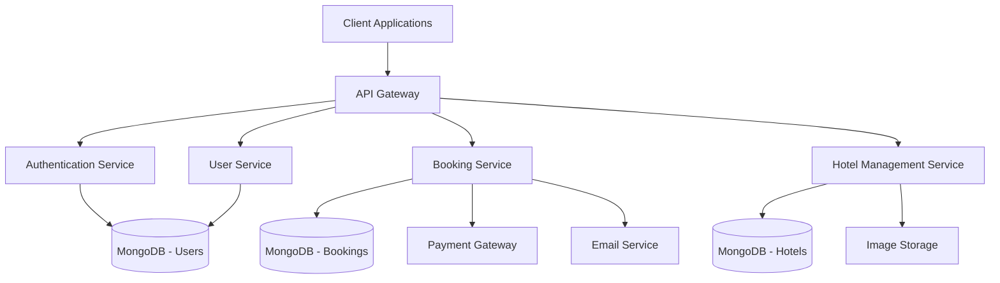
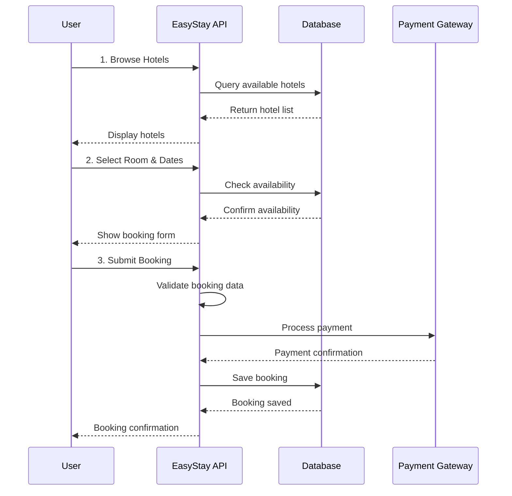
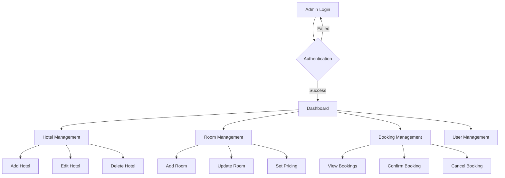

# 🏨 EasyStay - Hotel Booking Management System

<div align="center">


**Streamline your hotel booking experience with modern technology**

[](https://nodejs.org/)
[](https://expressjs.com/)
[](https://mongodb.com/)
[](https://jwt.io/)

[🚀 Quick Start](#-quick-start) • [📖 Documentation](#-api-documentation) • [🏗️ Architecture](#️-system-architecture) • [🤝 Contributing](#-contributing)

</div>

---

## 🌟 Overview

**EasyStay** is a comprehensive hotel booking management system designed for modern hospitality businesses. Built with cutting-edge technologies, it provides seamless booking experiences for guests while offering powerful management tools for hotel administrators.

### ✨ Key Features

```
🔐 Secure Authentication     📱 Mobile-First Design     🏨 Multi-Hotel Support
🛏️  Room Management         💳 Payment Integration     📊 Analytics Dashboard
👥 User Profiles            🔍 Advanced Search         📧 Email Notifications
⭐ Review System            📅 Booking Calendar        🌍 Multi-Language Support
```

---

## 🎯 Problem Statement

The hospitality industry faces challenges with:

- **Fragmented booking systems** leading to overbooking
- **Poor user experience** causing booking abandonment
- **Manual processes** increasing operational costs
- **Limited real-time visibility** into room availability

**EasyStay solves these problems** by providing a unified, automated, and user-friendly platform.

---

## 🏗️ System Architecture



### 🔧 Technology Stack

| Layer              | Technology           | Purpose                         |
| ------------------ | -------------------- | ------------------------------- |
| **Backend**        | Node.js + Express.js | RESTful API development         |
| **Database**       | MongoDB + Mongoose   | Data persistence & modeling     |
| **Authentication** | JWT + bcrypt         | Secure user authentication      |
| **Validation**     | Express Validator    | Input validation & sanitization |
| **Security**       | Helmet + CORS        | API security & protection       |

---

## 🚀 Quick Start

### Prerequisites

```bash
# Required software
Node.js >= 16.0.0
MongoDB >= 4.4.0
npm >= 8.0.0
```

### Installation

```bash
# 1. Clone the repository
git clone https://github.com/Santoshpatel112/Hotel-Booking.git
cd Hotel-Booking

# 2. Install dependencies
cd api
npm install

# 3. Environment setup
cp .env.example .env
# Edit .env with your configuration

# 4. Start MongoDB service
# Windows: net start MongoDB
# macOS: brew services start mongodb-community
# Linux: sudo systemctl start mongod

# 5. Run the application
npm start
```

### 🔧 Environment Configuration

```env
# Database
MONGODB_URI=mongodb://localhost:27017/easystay
DB_NAME=easystay

# Authentication
JWT_SECRET=your_super_secret_jwt_key
JWT_EXPIRE=7d

# Server
PORT=5000
NODE_ENV=development

# Email Service (Optional)
EMAIL_HOST=smtp.gmail.com
EMAIL_PORT=587
EMAIL_USER=your_email@gmail.com
EMAIL_PASS=your_app_password
```

---

## 📖 API Documentation

### 🔐 Authentication Endpoints

| Method | Endpoint             | Description       | Auth Required |
| ------ | -------------------- | ----------------- | ------------- |
| `POST` | `/api/auth/register` | User registration | ❌            |
| `POST` | `/api/auth/login`    | User login        | ❌            |
| `POST` | `/api/auth/logout`   | User logout       | ✅            |
| `GET`  | `/api/auth/profile`  | Get user profile  | ✅            |

### 🏨 Hotel Management

| Method   | Endpoint          | Description       | Auth Required |
| -------- | ----------------- | ----------------- | ------------- |
| `GET`    | `/api/hotels`     | Get all hotels    | ❌            |
| `GET`    | `/api/hotels/:id` | Get hotel details | ❌            |
| `POST`   | `/api/hotels`     | Create new hotel  | ✅ (Admin)    |
| `PUT`    | `/api/hotels/:id` | Update hotel      | ✅ (Admin)    |
| `DELETE` | `/api/hotels/:id` | Delete hotel      | ✅ (Admin)    |

### 🛏️ Room Management

| Method   | Endpoint         | Description         | Auth Required |
| -------- | ---------------- | ------------------- | ------------- |
| `GET`    | `/api/rooms`     | Get available rooms | ❌            |
| `GET`    | `/api/rooms/:id` | Get room details    | ❌            |
| `POST`   | `/api/rooms`     | Add new room        | ✅ (Admin)    |
| `PUT`    | `/api/rooms/:id` | Update room         | ✅ (Admin)    |
| `DELETE` | `/api/rooms/:id` | Delete room         | ✅ (Admin)    |

### 👥 User Management

| Method | Endpoint              | Description       | Auth Required |
| ------ | --------------------- | ----------------- | ------------- |
| `GET`  | `/api/users/profile`  | Get user profile  | ✅            |
| `PUT`  | `/api/users/profile`  | Update profile    | ✅            |
| `GET`  | `/api/users/bookings` | Get user bookings | ✅            |

---

## 🔄 Application Workflow

### 📋 User Journey



### 🏨 Admin Workflow



---

## 📊 Database Schema

### 🏨 Hotel Model

```javascript
{
  name: String,           // Hotel name
  description: String,    // Hotel description
  address: {
    street: String,
    city: String,
    state: String,
    country: String,
    zipCode: String
  },
  amenities: [String],    // Pool, WiFi, Gym, etc.
  images: [String],       // Image URLs
  rating: Number,         // Average rating
  contact: {
    phone: String,
    email: String
  },
  createdAt: Date,
  updatedAt: Date
}
```

### 🛏️ Room Model

```javascript
{
  hotelId: ObjectId,      // Reference to Hotel
  roomNumber: String,     // Room identifier
  type: String,           // Single, Double, Suite
  capacity: Number,       // Max occupancy
  price: Number,          // Price per night
  amenities: [String],    // Room-specific amenities
  images: [String],       // Room images
  isAvailable: Boolean,   // Availability status
  createdAt: Date,
  updatedAt: Date
}
```

### 👤 User Model

```javascript
{
  firstName: String,
  lastName: String,
  email: String,          // Unique identifier
  password: String,       // Hashed password
  phone: String,
  role: String,           // 'user' | 'admin'
  profile: {
    avatar: String,
    dateOfBirth: Date,
    preferences: [String]
  },
  createdAt: Date,
  updatedAt: Date
}
```

---

## 🛡️ Security Features

### 🔐 Authentication & Authorization

- **JWT-based authentication** with secure token management
- **Role-based access control** (User, Admin)
- **Password hashing** using bcrypt with salt rounds
- **Input validation** and sanitization

### 🛡️ API Security

- **Rate limiting** to prevent abuse
- **CORS configuration** for cross-origin requests
- **Helmet.js** for security headers
- **Input validation** using express-validator

### 🔒 Data Protection

- **Environment variables** for sensitive data
- **MongoDB injection** prevention
- **XSS protection** through input sanitization

---

## 🧪 Testing

```bash
# Run all tests
npm test

# Run tests with coverage
npm run test:coverage

# Run specific test suite
npm run test:auth
npm run test:hotels
npm run test:rooms
```

### Test Coverage Goals

- **Unit Tests**: 90%+ coverage
- **Integration Tests**: API endpoints
- **E2E Tests**: Critical user journeys

---

## 🚀 Deployment

### 🐳 Docker Deployment

```bash
# Build and run with Docker
docker-compose up --build

# Production deployment
docker-compose -f docker-compose.prod.yml up -d
```

### ☁️ Cloud Deployment Options

- **Heroku**: Easy deployment with MongoDB Atlas
- **AWS**: EC2 + RDS/DocumentDB
- **Digital Ocean**: Droplets + Managed Databases
- **Vercel**: Serverless deployment

---

## 📈 Performance Optimization

### 🚀 Backend Optimizations

- **Database indexing** for faster queries
- **Connection pooling** for MongoDB
- **Caching strategies** with Redis
- **Image optimization** and CDN integration

### 📊 Monitoring

- **Application metrics** with custom dashboards
- **Error tracking** and logging
- **Performance monitoring** for API endpoints

---

## 🤝 Contributing

We welcome contributions! Please follow these steps:

### 🔄 Development Workflow

```bash
# 1. Fork the repository
# 2. Create feature branch
git checkout -b feature/amazing-feature

# 3. Make changes and commit
git commit -m "Add amazing feature"

# 4. Push to branch
git push origin feature/amazing-feature

# 5. Create Pull Request
```

### 📋 Contribution Guidelines

- Follow **ESLint** configuration
- Write **comprehensive tests**
- Update **documentation**
- Use **conventional commits**

---

## 📄 License

This project is licensed under the **MIT License** - see the [LICENSE](LICENSE) file for details.

---

## 🙏 Acknowledgments

- **Express.js** community for the robust framework
- **MongoDB** for flexible data modeling
- **JWT** for secure authentication
- **Open source contributors** who make development easier

---

## 📞 Support & Contact

<div align="center">

**Need help? We're here for you!**

[](https://github.com/Santoshpatel112/Hotel-Booking/issues)
[](mailto:santoshpatelvns5@gmail.com.com)
[](https://github.com/Santoshpatel112/Hotel-Booking/wiki)

**⭐ Star this repository if you find it helpful!**

</div>

---

<div align="center">

**Made with ❤️ by the Santosh Patel**

_Simplifying hotel bookings, one stay at a time._

</div>
