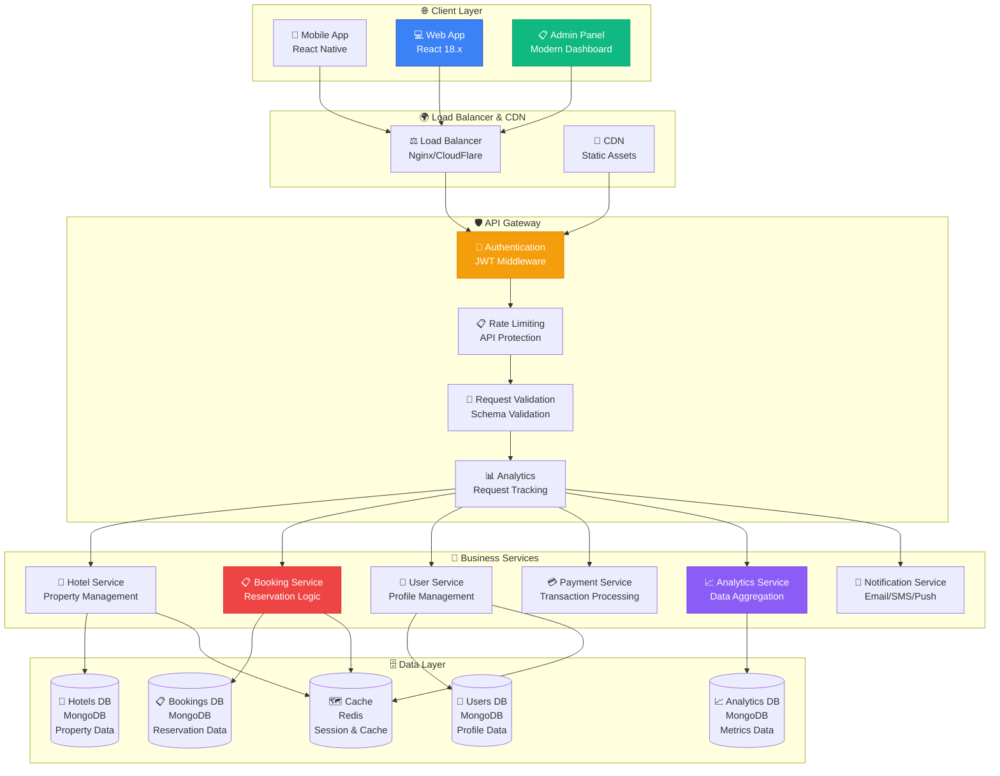

# 🏨 EasyStay - Hotel Booking & Management Platform

<div align="center">


**🚀 Next-Generation Hotel Booking Platform with Real-time Analytics & Interactive Data Visualization**

[✨ Live Demo](#-live-demo) • [🎯 Quick Start](#-quick-start) • [📊 Features](#-core-features) • [🛠️ Tech Stack](#️-technology-stack) • [📈 Analytics](#-analytics--data-visualization)

</div>

---

## 🎯 Platform Overview

**EasyStay** is a cutting-edge hotel management platform designed for modern hospitality businesses. Built with React 18, Node.js, and MongoDB, it delivers real-time booking management, advanced analytics, and interactive data visualization through Recharts integration.

### 🌟 **Why EasyStay?**
- 🎨 **Modern UI/UX**: Glass morphism design with Framer Motion animations
- 📱 **Fully Responsive**: Mobile-first design that works on all devices
- 🌙 **Dark Mode**: Professional theme switching with persistent preferences
- ⚡ **Real-time Updates**: Live dashboard with 30-second auto-refresh
- 📊 **Interactive Charts**: Recharts-powered data visualization
- 🔐 **Enterprise Security**: JWT authentication with role-based access

---

## 🎬 Application Workflow Animation

### 🔄 **Complete User Journey Flow**

``mermaid
flowchart TD
    subgraph "🌐 Client Access Layer"
        A1["👤 Guest User"] 
        A2["👨‍💼 Hotel Staff"]
        A3["👩‍💻 Admin User"]
    end
    
    subgraph "🎨 Frontend Application"
        B1["🏠 Landing Page<br/>- Modern Hero Section<br/>- Search Interface"]
        B2["🔍 Search Results<br/>- Grid/List Toggle<br/>- Advanced Filters"]
        B3["🏨 Hotel Details<br/>- Image Gallery<br/>- Room Selection"]
        B4["💳 Booking Flow<br/>- Guest Details<br/>- Payment Gateway"]
        B5["📊 Admin Dashboard<br/>- Real-time Analytics<br/>- Interactive Charts"]
    end
    
    subgraph "⚡ API Gateway & Authentication"
        C1["🔐 JWT Auth Middleware"]
        C2["🛡️ Role-based Access"]
        C3["📝 Request Validation"]
    end
    
    subgraph "🎯 Business Logic Controllers"
        D1["🏨 Hotel Controller<br/>- CRUD Operations<br/>- Search & Filter"]
        D2["📅 Booking Controller<br/>- Reservation Logic<br/>- Payment Processing"]
        D3["👥 User Controller<br/>- Profile Management<br/>- Authentication"]
        D4["📈 Analytics Controller<br/>- Data Aggregation<br/>- Chart Generation"]
    end
    
    subgraph "🗄️ Data Persistence Layer"
        E1[("👥 Users Collection<br/>- Profile Data<br/>- Auth Tokens<br/>- Preferences")]
        E2[("🏨 Hotels Collection<br/>- Property Details<br/>- Amenities<br/>- Pricing")]
        E3[("📋 Bookings Collection<br/>- Reservation Data<br/>- Payment Status<br/>- Guest Details")]
    end
    
    subgraph "🌍 External Services"
        F1["💰 Payment Gateway<br/>- Stripe/PayPal<br/>- Transaction Processing"]
        F2["📧 Email Service<br/>- Booking Confirmations<br/>- Notifications"]
        F3["☁️ File Storage<br/>- Image Upload<br/>- Document Management"]
    end
    
    %% User Flow Connections
    A1 --> B1
    A2 --> B5
    A3 --> B5
    
    B1 --> B2
    B2 --> B3
    B3 --> B4
    B4 --> B1
    
    %% API Layer Connections
    B1 --> C1
    B2 --> C1
    B3 --> C1
    B4 --> C1
    B5 --> C1
    
    C1 --> C2
    C2 --> C3
    
    %% Business Logic Routing
    C3 --> D1
    C3 --> D2
    C3 --> D3
    C3 --> D4
    
    %% Database Operations
    D1 --> E2
    D2 --> E3
    D3 --> E1
    D4 --> E1
    D4 --> E2
    D4 --> E3
    
    %% External Service Integration
    D2 --> F1
    D2 --> F2
    D1 --> F3
    
    %% Styling
    style A1 fill:#3b82f6,stroke:#1e40af,color:#fff
    style A2 fill:#10b981,stroke:#059669,color:#fff
    style A3 fill:#f59e0b,stroke:#d97706,color:#fff
    style B5 fill:#8b5cf6,stroke:#7c3aed,color:#fff
    style D4 fill:#ef4444,stroke:#dc2626,color:#fff
    
    classDef userClass fill:#dbeafe,stroke:#3b82f6,stroke-width:2px
    classDef frontendClass fill:#d1fae5,stroke:#10b981,stroke-width:2px
    classDef apiClass fill:#fef3c7,stroke:#f59e0b,stroke-width:2px
    classDef dataClass fill:#fde2e8,stroke:#ef4444,stroke-width:2px
    
    class A1,A2,A3 userClass
    class B1,B2,B3,B4,B5 frontendClass
    class C1,C2,C3,D1,D2,D3,D4 apiClass
    class E1,E2,E3,F1,F2,F3 dataClass
```

### 🎯 **Real-time Data Flow Architecture**

``mermaid
sequenceDiagram
    participant U as 👤 User
    participant F as 🎨 Frontend
    participant A as ⚡ API Server
    participant D as 🗄️ Database
    participant P as 💳 Payment
    participant E as 📧 Email
    
    Note over U,E: 🚀 Complete Booking Journey
    
    U->>F: 1. 🔍 Search Hotels
    F->>A: GET /api/hotels?location=mumbai
    A->>D: Query hotels collection
    D-->>A: Return filtered results
    A-->>F: JSON response with hotels
    F-->>U: 📋 Display search results
    
    U->>F: 2. 🏨 Select Hotel & Room
    F->>A: GET /api/hotels/:id/details
    A->>D: Fetch hotel details
    D-->>A: Hotel data with amenities
    A-->>F: Complete hotel information
    F-->>U: 🖼️ Show hotel details page
    
    U->>F: 3. 📅 Create Booking
    F->>A: POST /api/bookings/create
    Note over A: 🔐 JWT Authentication
    A->>D: Create booking record
    D-->>A: Booking ID generated
    
    A->>P: 4. 💰 Process Payment
    P-->>A: Payment confirmation
    A->>D: Update booking status
    
    A->>E: 5. 📧 Send Confirmation
    E-->>A: Email sent successfully
    
    A-->>F: ✅ Booking confirmation
    F-->>U: 🎉 Success page with details
    
    Note over U,E: 📊 Real-time Analytics Update
    
    A->>D: 6. 📈 Update analytics
    D-->>A: New metrics calculated
    A-->>F: WebSocket/polling update
    F-->>U: 📊 Live dashboard refresh
```

---

## 🗃️ Data Structure

### **Hotel Data Schema**
| Field | Type | Description | Example |
|-------|------|-------------|---------|
| `hotel_id` | String | Unique identifier | "HTL001" |
| `name` | String | Hotel name | "Grand Plaza Hotel" |
| `location` | Object | Address details | `{city: "Mumbai", state: "MH"}` |
| `price_range` | Object | Room pricing | `{min: 2500, max: 8500}` |
| `amenities` | Array | Available services | `["WiFi", "Pool", "Spa"]` |
| `rating` | Number | Average rating | 4.5 |
| `availability` | Number | Available rooms | 12 |
| `created_at` | Date | Registration date | "2024-01-15T10:30:00Z" |

### **Booking Data Schema**
| Field | Type | Description | Example |
|-------|------|-------------|---------|
| `booking_id` | String | Unique booking ID | "BKG001234" |
| `user_id` | String | Customer ID | "USR789" |
| `hotel_id` | String | Hotel reference | "HTL001" |
| `check_in` | Date | Arrival date | "2024-03-15" |
| `check_out` | Date | Departure date | "2024-03-18" |
| `guests` | Number | Number of guests | 2 |
| `room_type` | String | Room category | "Deluxe Suite" |
| `total_amount` | Number | Total cost | 15750.00 |
| `status` | String | Booking status | "confirmed" |
| `payment_status` | String | Payment state | "completed" |

### **Sample Industry Data**
``json
{
  "daily_metrics": {
    "date": "2024-03-15",
    "total_bookings": 45,
    "revenue": 125000,
    "occupancy_rate": 78.5,
    "avg_daily_rate": 2777.78,
    "cancellation_rate": 5.2
  },
  "booking_channels": {
    "direct": 35,
    "online_travel_agencies": 60,
    "walk_ins": 5
  },
  "performance_kpis": {
    "conversion_rate": 12.8,
    "average_stay_duration": 2.1,
    "customer_satisfaction": 4.3
  }
}
```

---

## ⚙️ Processing Workflow Diagram

``mermaid
flowchart LR
    A[Data Input] --> B[Validation Layer]
    B --> C{Data Valid?}
    
    C -->|Yes| D[Data Processing]
    C -->|No| E[Error Handling]
    E --> F[User Notification]
    F --> A
    
    D --> G[Database Update]
    G --> H[Analytics Engine]
    H --> I[Chart Generation]
    I --> J[Dashboard Update]
    
    J --> K[Real-time Visualization]
    K --> L[Export Options]
    
    L --> M[PDF Reports]
    L --> N[Excel Exports]
    L --> O[API Endpoints]
    
    style D fill:#3b82f6,stroke:#1e40af,color:#fff
    style I fill:#10b981,stroke:#059669,color:#fff
    style K fill:#f59e0b,stroke:#d97706,color:#fff
    
    subgraph "Data Processing Pipeline"
        D
        G
        H
    end
    
    subgraph "Visualization Layer"
        I
        J
        K
    end
    
    subgraph "Export Layer"
        M
        N
        O
    end
```

---

## 📈 Analytics & Data Visualization

### 🎨 **Interactive Recharts Integration**

<div align="center">

| Chart Component | Technology | Real-time | Export Options | Mobile Optimized |
|:---------------:|:----------:|:---------:|:--------------:|:----------------:|
| 📈 **Area Charts** | Recharts 3.x | ✅ 30s refresh | PNG, PDF, Excel | ✅ Responsive |
| 📋 **Bar Charts** | Recharts 3.x | ✅ Live data | PNG, PDF, Excel | ✅ Touch-friendly |
| 🕯️ **Pie Charts** | Recharts 3.x | ✅ Auto-update | PNG, PDF, Excel | ✅ Gesture support |
| 📈 **Line Charts** | Recharts 3.x | ✅ Real-time | PNG, PDF, Excel | ✅ Zoom & pan |

</div>

### ⚡ **Real-time Dashboard Features**

``javascript
// Live Chart Configuration Example
const DashboardCharts = {
  // Booking Trends with Live Updates
  bookingTrends: {
    component: 'AreaChart',
    dataSource: '/api/analytics/booking-trends',
    refreshInterval: 30000, // 30 seconds
    animations: {
      entry: 'fadeIn',
      update: 'smooth',
      duration: 800
    },
    responsive: {
      breakpoints: ['xs', 'sm', 'md', 'lg', 'xl'],
      aspectRatio: '16:9'
    },
    interactivity: {
      tooltip: 'detailed',
      zoom: true,
      pan: true,
      clickToFilter: true
    },
    exportOptions: ['PNG', 'PDF', 'Excel', 'CSV']
  },
  
  // Revenue Analytics
  revenueAnalytics: {
    component: 'ComposedChart',
    layers: ['Bar', 'Line', 'Area'],
    dataPoints: {
      daily_revenue: 'bar',
      trend_line: 'line',
      cumulative: 'area'
    },
    colorScheme: {
      primary: '#3b82f6',
      secondary: '#10b981',
      accent: '#f59e0b'
    }
  },
  
  // Occupancy Distribution
  occupancyBreakdown: {
    component: 'PieChart',
    dataSource: '/api/analytics/occupancy',
    features: {
      interactiveLegend: true,
      segmentHighlight: true,
      percentageLabels: true,
      animatedEntry: true
    }
  }
};

// Real-time Data Subscription
const useRealtimeData = (endpoint, interval = 30000) => {
  const [data, setData] = useState([]);
  const [loading, setLoading] = useState(true);
  
  useEffect(() => {
    const fetchData = async () => {
      try {
        const response = await api.get(endpoint);
        setData(response.data);
        setLoading(false);
      } catch (error) {
        console.error('Data fetch error:', error);
      }
    };
    
    // Initial fetch
    fetchData();
    
    // Set up interval for live updates
    const timer = setInterval(fetchData, interval);
    
    return () => clearInterval(timer);
  }, [endpoint, interval]);
  
  return { data, loading };
};
```

### 🎯 **Advanced Analytics Metrics**

- 📈 **Revenue Trends**: Daily/Monthly/Yearly revenue tracking with growth indicators
- 📋 **Booking Patterns**: Seasonal analysis, peak time identification, demand forecasting
- 🏨 **Hotel Performance**: Occupancy rates, average daily rates, revenue per room
- 👥 **User Analytics**: Registration trends, booking conversion rates, customer retention
- 📊 **Real-time KPIs**: Live dashboard with auto-refreshing metrics

---

## 🛠️ Technology Stack

<div align="center">

### 🎨 **Frontend Architecture**

| Layer | Technology | Version | Purpose | Features |
|:-----:|:----------:|:-------:|:-------:|:--------:|
| 🎨 **UI Framework** | React.js | 18.2.0 | Component architecture | Hooks, Context, Suspense |
| 🌈 **Styling** | Tailwind CSS | 3.4.1 | Utility-first CSS | Dark mode, Responsive, Custom themes |
| 🎬 **Animations** | Framer Motion | 12.x | Smooth transitions | Page transitions, Micro-interactions |
| 📈 **Charts** | Recharts | 3.2.0 | Data visualization | Interactive, Responsive, Real-time |
| 🎨 **Icons** | Lucide React | 0.543.0 | Modern iconography | Tree-shakable, Customizable |
| 🍭 **Notifications** | React Hot Toast | 2.6.0 | User feedback | Customizable, Accessible |
| 📱 **Responsive** | CSS Grid/Flexbox | Native | Layout system | Mobile-first, Adaptive |

### ⚡ **Backend Architecture**

| Layer | Technology | Version | Purpose | Features |
|:-----:|:----------:|:-------:|:-------:|:--------:|
| 🚀 **Runtime** | Node.js | 16.x+ | JavaScript runtime | Non-blocking I/O, Event-driven |
| 🌐 **Framework** | Express.js | 4.x | RESTful API | Middleware, Routing, CORS |
| 🗄️ **Database** | MongoDB | 4.4+ | Document storage | Scalable, Flexible schema |
| 🔐 **Authentication** | JWT + bcrypt | Latest | Secure auth | Token-based, Password hashing |
| 🛡️ **Security** | Helmet + CORS | Latest | API protection | Headers, Cross-origin |
| 📝 **Validation** | Express Validator | Latest | Input validation | Schema validation, Sanitization |

### 📆 **Database Schema**

| Collection | Documents | Indexes | Features |
|:----------:|:---------:|:-------:|:--------:|
| 👥 **Users** | ~10K+ | email, username | Authentication, Profiles |
| 🏨 **Hotels** | ~500+ | location, featured | Property management |
| 📋 **Bookings** | ~50K+ | userId, hotelId, dates | Reservation system |
| 📈 **Analytics** | ~1M+ | timestamp, type | Performance metrics |

</div>

### 🚀 **Performance Features**

- ⚡ **Code Splitting**: Dynamic imports for faster initial load
- 📏 **Lazy Loading**: Component-level lazy loading
- 📆 **Caching**: API response caching with Redis
- 📱 **PWA**: Progressive Web App capabilities
- 🔄 **Real-time**: WebSocket connections for live updates

---

## 🚀 Quick Start

### 📋 **Prerequisites**

<div align="center">

| Requirement | Version | Download Link | Status |
|:-----------:|:-------:|:-------------:|:------:|
| 🟢 **Node.js** | 16.0+ | [nodejs.org](https://nodejs.org/) | Required |
| 🍃 **MongoDB** | 4.4+ | [mongodb.com](https://mongodb.com/try/download/community) | Required |
| 📦 **npm** | 8.0+ | Included with Node.js | Required |
| 🦅 **Git** | Latest | [git-scm.com](https://git-scm.com/) | Required |

</div>

### 📎 **Installation Workflow**

``mermaid
flowchart TD
    A["📦 1. Clone Repository<br/>git clone & cd"] --> B["🔧 2. Install Dependencies<br/>npm install"]
    B --> C["⚙️ 3. Environment Setup<br/>.env configuration"]
    C --> D["🗄️ 4. Database Setup<br/>MongoDB connection"]
    D --> E["🚀 5. Start Services<br/>Backend + Frontend"]
    E --> F["✅ 6. Access Application<br/>localhost:3000"]
    
    style A fill:#3b82f6,stroke:#1e40af,color:#fff
    style C fill:#f59e0b,stroke:#d97706,color:#fff
    style E fill:#10b981,stroke:#059669,color:#fff
    style F fill:#ef4444,stroke:#dc2626,color:#fff
```

### 💻 **Step-by-Step Installation**

#### **📦 Step 1: Clone & Setup**

```bash
# Clone the repository
git clone https://github.com/YOUR_USERNAME/EasyStay-BookingApp.git
cd EasyStay-BookingApp

# Verify Node.js installation
node --version  # Should be 16.x or higher
npm --version   # Should be 8.x or higher
```

#### **🔧 Step 2: Backend Configuration**

```bash
# Navigate to backend directory
cd api

# Install backend dependencies
npm install

# Create environment configuration
cp .env.example .env

# Edit .env file with your configuration
# Use your preferred text editor
code .env  # VS Code
# OR
notepad .env  # Windows Notepad
```

#### **⚙️ Environment Configuration (.env)**

```env
# 🗄️ Database Configuration
MONGO_URL=mongodb://localhost:27017/easystay
DB_NAME=easystay

# 🔐 JWT Security Configuration
JWT_SECRET=your_super_secure_jwt_secret_key_here_2024
JWT_EXPIRE=7d

# 🚀 Server Configuration
PORT=8000
NODE_ENV=development
CORS_ORIGIN=http://localhost:3000

# 📧 Email Service (Optional)
EMAIL_SERVICE=gmail
EMAIL_USER=your.email@gmail.com
EMAIL_PASS=your_app_specific_password

# 💳 Payment Gateway (Optional)
STRIPE_SECRET_KEY=sk_test_your_stripe_secret_key
STRIPE_PUBLISHABLE_KEY=pk_test_your_stripe_publishable_key
```

#### **🎨 Step 3: Frontend Setup**

```bash
# Open new terminal and navigate to frontend
cd client

# Install frontend dependencies
npm install

# Clear any existing cache (Optional)
npm run clean  # If available
# OR manually clear cache
rm -rf node_modules/.cache .eslintcache  # macOS/Linux
# Remove-Item -Recurse -Force "node_modules\.cache", ".eslintcache" # PowerShell
```

#### **🗄️ Step 4: Database Setup**

```bash
# Start MongoDB service
# Windows:
net start MongoDB

# macOS:
brew services start mongodb-community

# Linux:
sudo systemctl start mongod

# Verify MongoDB connection
mongosh
# Should connect to MongoDB shell
# Type 'exit' to quit
```

#### **🚀 Step 5: Start Application**

```bash
# Terminal 1: Start Backend Server
cd api
npm start
# 🟢 Backend running on http://localhost:8000

# Terminal 2: Start Frontend Server
cd client
npm start
# 🟢 Frontend running on http://localhost:3000
# 🌐 Browser will automatically open
```

### ✅ **Verification Steps**

1. **🌐 Access Application**: Navigate to `http://localhost:3000`
2. **👤 Test Registration**: Create a new user account
3. **🔑 Admin Access**: Login with admin credentials:
   - Email: `admin123@gmail.com`
   - Password: `admin123`
4. **📊 Dashboard**: Click "Admin Dashboard" to view analytics
5. **🔍 Search Hotels**: Test the search and booking functionality

---

## 🌟 Live Demo

### 📋 **Quick Demo Access**

<div align="center">

| Demo Type | URL | Credentials | Features |
|:---------:|:---:|:-----------:|:--------:|
| 👥 **User Demo** | [localhost:3000](http://localhost:3000) | Register new account | Booking, Search, Profile |
| 👩‍💼 **Admin Demo** | [localhost:3000/admin](http://localhost:3000/admin) | admin123@gmail.com / admin123 | Analytics, Management |
| 📈 **API Demo** | [localhost:8000/api](http://localhost:8000/api) | Bearer token required | RESTful endpoints |

</div>

### 📱 **Sample API Requests**

```bash
# 🏨 Get all hotels
curl -X GET "http://localhost:8000/api/hotels" \
  -H "Content-Type: application/json"

# 🔍 Search hotels by location
curl -X GET "http://localhost:8000/api/hotels/search?city=Mumbai&checkin=2024-03-20&checkout=2024-03-23" \
  -H "Content-Type: application/json"

# 📋 Create new booking (requires authentication)
curl -X POST "http://localhost:8000/api/bookings" \
  -H "Content-Type: application/json" \
  -H "Authorization: Bearer YOUR_JWT_TOKEN" \
  -d '{
    "hotelId": "670123456789abcdef123456",
    "checkInDate": "2024-03-20",
    "checkOutDate": "2024-03-23",
    "guests": 2,
    "roomType": "Deluxe Room"
  }'

# 📈 Get booking analytics (admin only)
curl -X GET "http://localhost:8000/api/analytics/dashboard" \
  -H "Authorization: Bearer YOUR_ADMIN_TOKEN"
```

### 🎬 **Interactive Features Demo**

```javascript
// 📈 Real-time Dashboard Updates
const DashboardDemo = () => {
  const [metrics, setMetrics] = useState({});
  
  useEffect(() => {
    // Fetch initial data
    const fetchMetrics = async () => {
      const response = await api.get('/analytics/real-time');
      setMetrics(response.data);
    };
    
    fetchMetrics();
    
    // Set up real-time updates
    const interval = setInterval(fetchMetrics, 30000);
    
    return () => clearInterval(interval);
  }, []);
  
  return (
    <div className="dashboard-demo">
      <AreaChart data={metrics.bookingTrends}>
        <Area 
          type="monotone" 
          dataKey="bookings" 
          stroke="#3b82f6" 
          fill="#3b82f6" 
          fillOpacity={0.3}
        />
      </AreaChart>
    </div>
  );
};

// 🌙 Theme Toggle Demonstration
const ThemeDemo = () => {
  const [darkMode, setDarkMode] = useState(false);
  
  const toggleTheme = () => {
    setDarkMode(!darkMode);
    document.documentElement.classList.toggle('dark');
    toast.success(
      darkMode ? '☀️ Light mode activated' : '🌙 Dark mode activated'
    );
  };
  
  return (
    <button 
      onClick={toggleTheme}
      className="theme-toggle-demo"
    >
      {darkMode ? '☀️' : '🌙'} Toggle Theme
    </button>
  );
};
```

---

## 🏢 System Architecture

### 🚀 **Microservices Architecture Overview**


```mermaid
graph TB
    subgraph "🌐 Client Layer"
        A1["📱 Mobile App<br/>React Native"]
        A2["💻 Web App<br/>React 18.x"]
        A3["📋 Admin Panel<br/>Modern Dashboard"]
    end
    
    subgraph "🌍 Load Balancer & CDN"
        B1["⚖️ Load Balancer<br/>Nginx/CloudFlare"]
        B2["🚀 CDN<br/>Static Assets"]
    end
    
    subgraph "🛡️ API Gateway"
        C1["🔐 Authentication<br/>JWT Middleware"]
        C2["📋 Rate Limiting<br/>API Protection"]
        C3["📝 Request Validation<br/>Schema Validation"]
        C4["📊 Analytics<br/>Request Tracking"]
    end
    
    subgraph "🎯 Business Services"
        D1["🏨 Hotel Service<br/>Property Management"]
        D2["📋 Booking Service<br/>Reservation Logic"]
        D3["👥 User Service<br/>Profile Management"]
        D4["💳 Payment Service<br/>Transaction Processing"]
        D5["📈 Analytics Service<br/>Data Aggregation"]
        D6["📧 Notification Service<br/>Email/SMS/Push"]
    end
    
    subgraph "🗄️ Data Layer"
        E1[("🏨 Hotels DB<br/>MongoDB<br/>Property Data")]
        E2[("📋 Bookings DB<br/>MongoDB<br/>Reservation Data")]
        E3[("👥 Users DB<br/>MongoDB<br/>Profile Data")]
        E4[("📈 Analytics DB<br/>MongoDB<br/>Metrics Data")]
        E5[("🗺️ Cache<br/>Redis<br/>Session & Cache")]
    end
    
    %% Client Connections
    A1 --> B1
    A2 --> B1
    A3 --> B1
    
    %% Load Balancer
    B1 --> C1
    B2 --> C1
    
    %% API Gateway Flow
    C1 --> C2
    C2 --> C3
    C3 --> C4
    
    %% Service Routing
    C4 --> D1
    C4 --> D2
    C4 --> D3
    C4 --> D4
    C4 --> D5
    C4 --> D6
    
    %% Database Connections
    D1 --> E1
    D2 --> E2
    D3 --> E3
    D5 --> E4
    
    %% Cache Layer
    D1 --> E5
    D2 --> E5
    D3 --> E5
    
    %% Styling
    style A2 fill:#3b82f6,stroke:#1e40af,color:#fff
    style A3 fill:#10b981,stroke:#059669,color:#fff
    style C1 fill:#f59e0b,stroke:#d97706,color:#fff
    style D2 fill:#ef4444,stroke:#dc2626,color:#fff
    style D5 fill:#8b5cf6,stroke:#7c3aed,color:#fff
```

---

## 🤝 Contributing

### 🌟 **How to Contribute**

<div align="center">

| Step | Action | Description | Tools |
|:----:|:------:|:-----------:|:-----:|
| 1️⃣ | 🍴 **Fork** | Fork the repository | GitHub |
| 2️⃣ | 🌱 **Branch** | Create feature branch | `git checkout -b feature/analytics` |
| 3️⃣ | 📝 **Code** | Implement your changes | VS Code, WebStorm |
| 4️⃣ | ✅ **Test** | Run tests and linting | Jest, ESLint |
| 5️⃣ | 📤 **Commit** | Commit with clear message | `git commit -m "Add: revenue analytics"` |
| 6️⃣ | 🚀 **Push** | Push to your fork | `git push origin feature/analytics` |
| 7️⃣ | 🔄 **PR** | Create Pull Request | GitHub |

</div>

### 🐛 **Issue Reporting**

- 🐛 **Bug Reports** - Use GitHub Issues with detailed reproduction steps
- 💡 **Feature Requests** - Describe use case and expected behavior
- 📋 **Documentation** - Help improve setup and usage guides

---

## 📄 License

<div align="center">

### 📃 **MIT License**

**Free for personal and commercial use** • **Modify and distribute** • **No warranty provided**

[📄 View Full License](LICENSE) • [🌐 OSI Approved](https://opensource.org/licenses/MIT)

</div>

---

<div align="center">

## 🎆 **Ready to Transform Your Hotel Business?**

### 🚀 **Get Started in 5 Minutes**

[📦 **Clone Repository**](https://github.com/YOUR_USERNAME/EasyStay-BookingApp) • [📈 **View Analytics Demo**](http://localhost:3000/admin) • [📝 **Read Documentation**](#🚀-quick-start)

---

### 🌐 **Connect With Us**

[💬 **Discussions**](https://github.com/YOUR_USERNAME/EasyStay-BookingApp/discussions) • [🐛 **Report Issues**](https://github.com/YOUR_USERNAME/EasyStay-BookingApp/issues) • [📧 **Contact Support**](mailto:support@easystay.com)

---

**📊 Built with Modern Tech Stack** • **🌙 Dark Mode Support** • **📱 Mobile Optimized** • **⚡ Real-time Analytics**

**🏨 Powering the Future of Hospitality** • **© 2024 EasyStay Platform** • **📄 MIT Licensed**

---

### ⭐ **If this project helped your business, please star the repository!**

**💫 Your star motivates us to build better features for the hospitality industry**

</div>