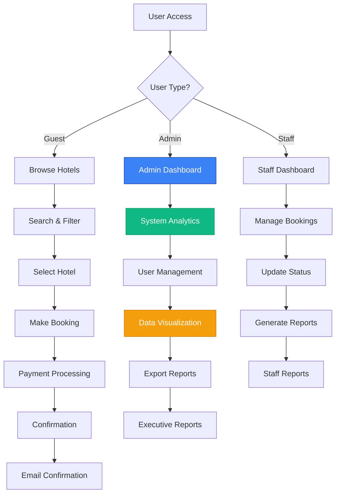
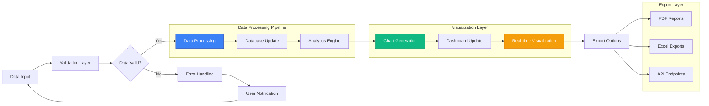
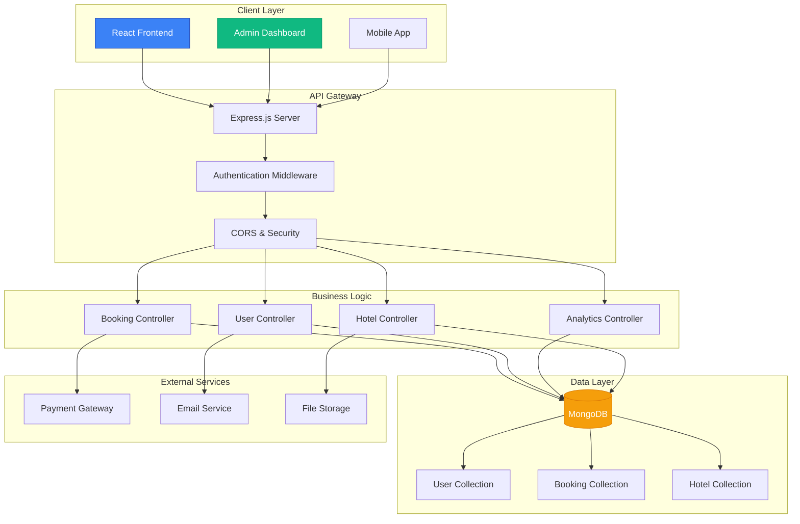

# 🏨 BOOKINGAPP - Enterprise Hotel Management & Analytics Platform

<div align="center">


**Modern hotel booking and management system designed for hospitality industry professionals**

[🚀 Quick Start](#-installation-instructions) | [📊 Features](#-key-features) | [🔧 Tech Stack](#-tech-stack) | [📈 Analytics](#-interactive-charts-analytics)

</div>

---

## 📋 Project Overview

**BOOKINGAPP** is a comprehensive hotel management platform built for hospitality industry professionals. It provides real-time booking management, advanced analytics, and interactive data visualization to optimize hotel operations and revenue management.

### **Target Industry Use Cases:**
- **Hotel Chains** - Multi-property management and analytics
- **Independent Hotels** - Streamlined booking and guest management  
- **Property Managers** - Centralized operations dashboard
- **Revenue Managers** - Real-time analytics and reporting
- **Hotel Administrators** - User and system management

---

## ✨ Key Features

### 🎯 **Core Functionality**
- ✅ **Real-time Booking Management** - Live reservation tracking and updates
- ✅ **Multi-role User System** - Guest, Staff, and Administrator access levels
- ✅ **Advanced Search & Filtering** - Location, price, amenities, and availability
- ✅ **Secure Payment Processing** - Integrated payment gateway support
- ✅ **Mobile-responsive Design** - Optimized for all devices and screen sizes

### 📊 **Analytics & Reporting**
- ✅ **Interactive Dashboard** - Real-time KPI monitoring and visualization
- ✅ **Revenue Analytics** - Daily, weekly, and monthly revenue tracking
- ✅ **Booking Trend Analysis** - Occupancy patterns and demand forecasting
- ✅ **Performance Metrics** - User engagement and conversion analytics
- ✅ **Export Capabilities** - PDF and Excel report generation

### 🎨 **Modern UI/UX**
- ✅ **Dark/Light Theme Toggle** - Professional appearance with user preferences
- ✅ **Interactive Charts** - Recharts-powered data visualization
- ✅ **Smooth Animations** - Framer Motion enhanced user experience
- ✅ **Responsive Tables** - Sortable, filterable data grids
- ✅ **Real-time Notifications** - Toast messages and status updates

---

## 👤 User Interaction Workflow


```mermaid
flowchart TD
    A[User Access] --> B{User Type?}
    
    B -->|Guest| C[Browse Hotels]
    B -->|Staff| D[Staff Dashboard]
    B -->|Admin| E[Admin Dashboard]
    
    C --> F[Search & Filter]
    F --> G[Select Hotel]
    G --> H[Make Booking]
    H --> I[Payment Processing]
    I --> J[Confirmation]
    
    D --> K[Manage Bookings]
    K --> L[Update Status]
    L --> M[Generate Reports]
    
    E --> N[System Analytics]
    N --> O[User Management]
    O --> P[Data Visualization]
    P --> Q[Export Reports]
    
    J --> R[Email Confirmation]
    M --> S[Staff Reports]
    Q --> T[Executive Reports]
    
    style E fill:#3b82f6,stroke:#1e40af,color:#fff
    style N fill:#10b981,stroke:#059669,color:#fff
    style P fill:#f59e0b,stroke:#d97706,color:#fff
```

---

## 🗃️ Data Structure

### **Hotel Data Schema**
| Field | Type | Description | Example |
|-------|------|-------------|---------|
| `hotel_id` | String | Unique identifier | "HTL001" |
| `name` | String | Hotel name | "Grand Plaza Hotel" |
| `location` | Object | Address details | `{city: "Mumbai", state: "MH"}` |
| `price_range` | Object | Room pricing | `{min: 2500, max: 8500}` |
| `amenities` | Array | Available services | `["WiFi", "Pool", "Spa"]` |
| `rating` | Number | Average rating | 4.5 |
| `availability` | Number | Available rooms | 12 |
| `created_at` | Date | Registration date | "2024-01-15T10:30:00Z" |

### **Booking Data Schema**
| Field | Type | Description | Example |
|-------|------|-------------|---------|
| `booking_id` | String | Unique booking ID | "BKG001234" |
| `user_id` | String | Customer ID | "USR789" |
| `hotel_id` | String | Hotel reference | "HTL001" |
| `check_in` | Date | Arrival date | "2024-03-15" |
| `check_out` | Date | Departure date | "2024-03-18" |
| `guests` | Number | Number of guests | 2 |
| `room_type` | String | Room category | "Deluxe Suite" |
| `total_amount` | Number | Total cost | 15750.00 |
| `status` | String | Booking status | "confirmed" |
| `payment_status` | String | Payment state | "completed" |

### **Sample Industry Data**
```json
{
  "daily_metrics": {
    "date": "2024-03-15",
    "total_bookings": 45,
    "revenue": 125000,
    "occupancy_rate": 78.5,
    "avg_daily_rate": 2777.78,
    "cancellation_rate": 5.2
  },
  "booking_channels": {
    "direct": 35,
    "online_travel_agencies": 60,
    "walk_ins": 5
  },
  "performance_kpis": {
    "conversion_rate": 12.8,
    "average_stay_duration": 2.1,
    "customer_satisfaction": 4.3
  }
}
```

---

## ⚙️ Processing Workflow Diagram


```mermaid
flowchart LR
    A[Data Input] --> B[Validation Layer]
    B --> C{Data Valid?}
    
    C -->|Yes| D[Data Processing]
    C -->|No| E[Error Handling]
    E --> F[User Notification]
    F --> A
    
    D --> G[Database Update]
    G --> H[Analytics Engine]
    H --> I[Chart Generation]
    I --> J[Dashboard Update]
    
    J --> K[Real-time Visualization]
    K --> L[Export Options]
    
    L --> M[PDF Reports]
    L --> N[Excel Exports]
    L --> O[API Endpoints]
    
    style D fill:#3b82f6,stroke:#1e40af,color:#fff
    style I fill:#10b981,stroke:#059669,color:#fff
    style K fill:#f59e0b,stroke:#d97706,color:#fff
    
    subgraph "Data Processing Pipeline"
        D
        G
        H
    end
    
    subgraph "Visualization Layer"
        I
        J
        K
    end
    
    subgraph "Export Layer"
        M
        N
        O
    end
```

---

## 📈 Interactive Charts & Analytics

### **Supported Chart Types**

<div align="center">

| Chart Type | Use Case | Interactivity | Data Source |
|:----------:|:--------:|:-------------:|:-----------:|
| 📊 **Bar Charts** | Revenue comparison, booking counts | Hover tooltips, click to drill-down | Daily/Monthly aggregates |
| 📈 **Line Charts** | Trend analysis, performance tracking | Zoom, pan, data point details | Time-series data |
| 🥧 **Pie Charts** | Market share, booking distribution | Segment highlighting, legends | Categorical breakdowns |
| 📊 **Area Charts** | Cumulative metrics, capacity utilization | Interactive legends, stacking | Multi-dimensional data |

</div>

### **Dashboard Analytics Preview**

```typescript
// Interactive Chart Configuration
const chartConfig = {
  revenue_chart: {
    type: 'bar',
    data: 'monthly_revenue',
    interactive: true,
    exports: ['PNG', 'PDF', 'Excel']
  },
  booking_trends: {
    type: 'area',
    data: 'daily_bookings',
    real_time: true,
    refresh_interval: 30000
  },
  occupancy_distribution: {
    type: 'pie',
    data: 'room_categories',
    animations: 'enabled',
    legend: 'interactive'
  }
};
```

### **Real-time Dashboard Features**
- 🔄 **Auto-refresh** - Live data updates every 30 seconds
- 🎯 **Click-to-filter** - Interactive chart filtering and drilling
- 📱 **Responsive design** - Optimized for mobile and tablet viewing
- 🎨 **Theme support** - Dark/light mode compatibility
- 📊 **Export options** - PDF, Excel, and image downloads

---

## 🛠️ Tech Stack

<div align="center">

### **Frontend Architecture**
| Component | Technology | Version | Purpose |
|:---------:|:----------:|:-------:|:-------:|
| 🎨 **Framework** | React.js | 18.x | Component-based UI |
| 🎭 **Animations** | Framer Motion | 12.x | Smooth transitions |
| 📊 **Charts** | Recharts | 3.x | Data visualization |
| 🎨 **Icons** | React Icons (FA) | 5.x | Consistent iconography |
| 🍞 **Notifications** | React Hot Toast | 2.x | User feedback |
| 🌐 **Routing** | React Router | 6.x | Navigation management |

### **Backend Architecture**
| Component | Technology | Version | Purpose |
|:---------:|:----------:|:-------:|:-------:|
| ⚡ **Runtime** | Node.js | 16.x+ | JavaScript runtime |
| 🌐 **Framework** | Express.js | 4.x | RESTful API |
| 🗄️ **Database** | MongoDB | 4.4+ | Document storage |
| 🔐 **Authentication** | JWT + bcrypt | Latest | Secure auth |
| 🛡️ **Security** | CORS + Helmet | Latest | API protection |
| 🔄 **Proxy** | http-proxy-middleware | 2.x | Request routing |

</div>

---

## 🚀 Installation Instructions

### **Prerequisites**
- ✅ Node.js 16.0+ ([Download](https://nodejs.org/))
- ✅ MongoDB 4.4+ ([Download](https://mongodb.com/try/download/community))
- ✅ npm 8.0+ (included with Node.js)
- ✅ Git ([Download](https://git-scm.com/))

### **Step 1: Clone Repository**
```bash
# Clone the repository
git clone https://github.com/YOUR_USERNAME/BOOKINGAPP.git
cd BOOKINGAPP
```

### **Step 2: Backend Setup**
```bash
# Navigate to backend directory
cd api

# Install dependencies
npm install

# Create environment file
cp .env.example .env

# Configure environment variables
# Edit .env file with your MongoDB connection string
```

### **Environment Configuration (.env)**
```env
# Database Configuration
MONGO_URL=mongodb://localhost:27017/bookingapp
DB_NAME=bookingapp

# JWT Configuration
JWT_SECRET=your_super_secret_jwt_key_here
JWT_EXPIRE=7d

# Server Configuration
PORT=8000
NODE_ENV=development

# Email Configuration (Optional)
EMAIL_SERVICE=gmail
EMAIL_USER=your.email@gmail.com
EMAIL_PASS=your_app_password
```

### **Step 3: Frontend Setup**
```bash
# Open new terminal and navigate to frontend
cd client

# Install dependencies
npm install

# Clear any existing cache (PowerShell)
if (Test-Path "node_modules\.cache") { Remove-Item -Recurse -Force "node_modules\.cache" }
if (Test-Path ".eslintcache") { Remove-Item -Force ".eslintcache" }
```

### **Step 4: Database Setup**
```bash
# Start MongoDB service
# Windows: net start MongoDB
# macOS: brew services start mongodb-community
# Linux: sudo systemctl start mongod

# Verify MongoDB is running
mongosh
# Should connect successfully
```

### **Step 5: Start Application**
```bash
# Terminal 1: Start backend server
cd api
npm start
# Backend running on http://localhost:8000

# Terminal 2: Start frontend server
cd client  
npm start
# Frontend running on http://localhost:3000
```

---

## 💼 Usage Example

### **Admin Dashboard Access**
1. **Navigate** to `http://localhost:3000`
2. **Login** with admin credentials:
   - Email: `admin123@gmail.com`
   - Password: `admin123`
3. **Click** "Admin Dashboard" button in navbar
4. **Explore** interactive charts and analytics

### **Sample API Requests**
```bash
# Get all hotels
curl -X GET http://localhost:8000/api/hotels

# Create new booking
curl -X POST http://localhost:8000/api/bookings \
  -H "Content-Type: application/json" \
  -H "Authorization: Bearer YOUR_JWT_TOKEN" \
  -d '{
    "hotel_id": "HTL001",
    "check_in": "2024-03-15",
    "check_out": "2024-03-18",
    "guests": 2,
    "room_type": "deluxe"
  }'

# Get booking analytics
curl -X GET http://localhost:8000/api/analytics/bookings \
  -H "Authorization: Bearer YOUR_ADMIN_TOKEN"
```

### **Dashboard Features Demo**
```javascript
// Example: Real-time chart data update
const updateDashboard = () => {
  // Fetch latest metrics
  const metrics = await api.get('/analytics/real-time');
  
  // Update chart data
  setChartData({
    revenue: metrics.daily_revenue,
    bookings: metrics.booking_count,
    occupancy: metrics.occupancy_rate
  });
  
  // Show success notification
  toast.success('Dashboard updated successfully');
};
```

---

## 📊 System Architecture


```mermaid
graph TB
    subgraph "Client Layer"
        A[React Frontend]
        B[Admin Dashboard]
        C[Mobile App]
    end
    
    subgraph "API Gateway"
        D[Express.js Server]
        E[Authentication Middleware]
        F[CORS & Security]
    end
    
    subgraph "Business Logic"
        G[Booking Controller]
        H[User Controller]
        I[Analytics Controller]
        J[Hotel Controller]
    end
    
    subgraph "Data Layer"
        K[(MongoDB)]
        L[User Collection]
        M[Booking Collection]
        N[Hotel Collection]
    end
    
    subgraph "External Services"
        O[Payment Gateway]
        P[Email Service]
        Q[File Storage]
    end
    
    A --> D
    B --> D
    C --> D
    
    D --> E
    E --> F
    F --> G
    F --> H
    F --> I
    F --> J
    
    G --> K
    H --> K
    I --> K
    J --> K
    
    K --> L
    K --> M
    K --> N
    
    G --> O
    H --> P
    J --> Q
    
    style A fill:#3b82f6,stroke:#1e40af,color:#fff
    style B fill:#10b981,stroke:#059669,color:#fff
    style K fill:#f59e0b,stroke:#d97706,color:#fff
```

---

## 🤝 Contributing

We welcome contributions from the hospitality and development community!

### **How to Contribute**
1. 🍴 **Fork** the repository
2. 🌿 **Create** feature branch (`git checkout -b feature/hotel-analytics`)
3. 💾 **Commit** changes (`git commit -m 'Add advanced analytics'`)
4. 📤 **Push** to branch (`git push origin feature/hotel-analytics`)
5. 🔄 **Create** Pull Request

### **Development Guidelines**
- ✅ Follow existing code style and patterns
- ✅ Add tests for new features
- ✅ Update documentation for API changes
- ✅ Ensure responsive design compatibility
- ✅ Test on multiple browsers and devices

### **Reporting Issues**
- 🐛 **Bug Reports** - Use GitHub Issues with detailed reproduction steps
- 💡 **Feature Requests** - Describe use case and expected behavior
- 📚 **Documentation** - Help improve setup and usage guides

---

## 📄 License

This project is licensed under the **MIT License** - see the [LICENSE](LICENSE) file for details.

### **MIT License Summary**
- ✅ Commercial use allowed
- ✅ Modification allowed
- ✅ Distribution allowed
- ✅ Private use allowed
- ❌ No warranty provided
- ❌ No liability assumed

---

<div align="center">

### 🎉 **Ready to Transform Your Hotel Management?**

**[🚀 Get Started Now](#-installation-instructions)** | **[📊 View Demo](http://localhost:3000)** | **[📞 Contact Support](mailto:support@bookingapp.com)**

---

**Built with ❤️ for the Hospitality Industry** | **© 2024 BOOKINGAPP** | **Version 2.0.0**

⭐ **Star this repository if it helped your hotel business!**

</div>