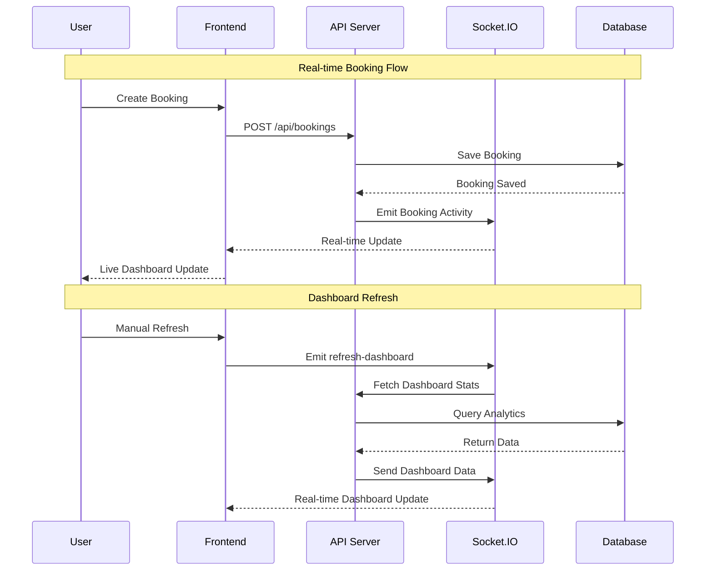

# Real-time Dashboard Implementation Guide

## 🚀 Overview

This document outlines the complete real-time dashboard system implemented for the EasyStay booking platform. The system provides live updates for booking activities, user registrations, and dashboard metrics using Socket.IO.

## 📋 Implementation Summary

### ✅ **Backend Components Created**

#### 1. Analytics Controller (`/api/Controllers/analytics.js`)
- **Real-time statistics endpoint**: `/api/analytics/dashboard`
- **Live metrics endpoint**: `/api/analytics/live`
- **Revenue analytics endpoint**: `/api/analytics/revenue`
- Comprehensive dashboard data with growth percentages
- Parallel database queries for optimal performance
- Time-based filtering and aggregation

#### 2. Socket.IO Server (`/api/utils/socket.js`)
- WebSocket server with JWT authentication
- Admin-only dashboard room management
- Real-time event broadcasting
- Activity notifications for bookings and user actions
- Connection management and error handling

#### 3. Analytics Routes (`/api/routes/analytics.js`)
- Protected admin routes for analytics endpoints
- Integration with existing authentication middleware

#### 4. Enhanced Controllers
- **Booking Controller**: Real-time hooks for booking events
- **Auth Controller**: Real-time hooks for user registration/login
- Automatic activity broadcasting on data changes

### ✅ **Frontend Components Created**

#### 1. Socket.IO Hook (`/client/src/hooks/useSocket.js`)
- Custom React hook for WebSocket management
- Automatic connection/reconnection handling
- Real-time data state management
- Toast notifications for live events
- Admin dashboard subscription

#### 2. Enhanced Dashboard Component
- Real-time data integration with fallback to API
- Live connection status indicator
- Auto-refresh capabilities
- Real-time activity feed updates

## 🔧 **Real-time Features**

### **Dashboard Statistics**
- **Live Metrics**: Total bookings, revenue, users, hotels
- **Growth Indicators**: Today vs yesterday, month vs last month
- **Real-time Charts**: Revenue trends, booking patterns
- **Activity Feed**: Live booking and user activity

### **Event Broadcasting**
- **Booking Events**: Created, updated, cancelled, payment confirmed
- **User Events**: Registration, login, logout
- **System Events**: Admin notifications, errors, updates

### **Data Refresh**
- **Automatic Updates**: 30-second intervals for dashboard stats
- **Event-driven Updates**: Immediate updates on user actions
- **Manual Refresh**: Admin-triggered dashboard refresh
- **Fallback Mode**: API polling when WebSocket unavailable

## 🎯 **Key Features**

### **Admin Dashboard**
```javascript
// Real-time dashboard statistics
const stats = {
  overview: {
    totalBookings: 1250,
    totalUsers: 890,
    totalHotels: 45,
    totalRevenue: 4375000,
    todayBookings: 23,
    todayRevenue: 80500,
    monthlyBookings: 340,
    monthlyRevenue: 1190000,
    todayGrowth: 12.5,
    monthlyGrowth: 8.7
  },
  recentActivity: [...],
  statusDistribution: {...},
  monthlyPerformance: [...]
}
```

### **Live Activity Feed**
```javascript
// Real-time activity examples
const activities = [
  {
    type: 'booking',
    action: 'created',
    user: 'John Doe',
    hotel: 'Luxury Resort Mumbai',
    amount: 15000,
    timestamp: '2025-01-20T10:30:00Z'
  },
  {
    type: 'user',
    action: 'registered',
    user: 'Jane Smith',
    timestamp: '2025-01-20T10:25:00Z'
  }
]
```

### **WebSocket Events**
```javascript
// Socket.IO event structure
socket.on('dashboard-update', (data) => {
  // Complete dashboard statistics update
});

socket.on('activity-update', (activity) => {
  // New booking/user activity
});

socket.on('live-metrics', (metrics) => {
  // Quick metrics for real-time indicators
});
```

## 🔄 **Data Flow Architecture**



## 📈 **Performance Optimizations**

### **Database Queries**
- Parallel aggregation queries for statistics
- Indexed database fields for fast lookups
- Optimized date range queries
- Pagination for large datasets

### **WebSocket Management**
- Connection pooling and cleanup
- Event throttling for high-frequency updates
- Error handling and reconnection logic
- Memory-efficient event broadcasting

### **Frontend Optimizations**
- Debounced state updates
- Memoized dashboard components
- Efficient re-rendering with React hooks
- Fallback mechanisms for offline scenarios

## 🛠️ **API Endpoints**

### **Analytics Endpoints**
```javascript
// Dashboard statistics
GET /api/analytics/dashboard
// Response: Complete dashboard data with metrics

// Live metrics
GET /api/analytics/live
// Response: Recent activity metrics

// Revenue analytics
GET /api/analytics/revenue?period=7d
// Response: Revenue data for specified period
```

### **Socket.IO Events**
```javascript
// Client to Server
socket.emit('subscribe-dashboard');
socket.emit('refresh-dashboard');
socket.emit('request-live-data');

// Server to Client
socket.on('dashboard-update', callback);
socket.on('activity-update', callback);
socket.on('live-metrics', callback);
socket.on('system-notification', callback);
```

## 🔒 **Security Features**

### **Authentication**
- JWT token validation for WebSocket connections
- Admin-only access to dashboard rooms
- Secure cookie handling for authentication
- Token expiration and refresh handling

### **Data Protection**
- Sanitized database queries
- Protected API endpoints
- CORS configuration for WebSocket
- Error message sanitization

## 🚀 **Getting Started**

### **1. Server Setup**
```bash
cd api
npm install socket.io
# Socket.IO already installed

# Start the server
npm run dev
```

### **2. Client Setup**
```bash
cd client
npm install socket.io-client
# Already installed

# Start the client
npm start
```

### **3. Access Dashboard**
1. Login as admin: `santoshpatelvns5@gmail.com`
2. Navigate to admin dashboard
3. Real-time connection will be established automatically
4. Dashboard will display live data and activity

## 📊 **Real-time Metrics**

### **Dashboard Stats**
- **Total Revenue**: Live calculation from paid bookings
- **Total Bookings**: Real-time count with growth indicators
- **Active Users**: Dynamic user count with registration tracking
- **Today's Performance**: Daily metrics with percentage growth

### **Activity Monitoring**
- **Booking Activities**: Create, update, cancel, payment events
- **User Activities**: Registration, login, profile updates
- **System Events**: Admin actions, errors, maintenance

### **Performance Indicators**
- **Connection Status**: Live/Offline indicator
- **Data Freshness**: Timestamp of last update
- **Growth Metrics**: Percentage changes over time
- **Response Times**: Real-time performance monitoring

## 🔄 **Live Updates Demo**

To test the real-time functionality:

1. **Open Admin Dashboard** in one browser tab
2. **Create a Booking** in another tab/device
3. **Watch Real-time Updates** appear in the dashboard
4. **Monitor Activity Feed** for live booking notifications
5. **Check Statistics** for immediate data updates

## 🎯 **Benefits**

### **For Administrators**
- **Instant Visibility**: Real-time business metrics
- **Live Monitoring**: Active booking and user activity
- **Quick Response**: Immediate notification of issues
- **Data-driven Decisions**: Up-to-date analytics

### **For System Performance**
- **Reduced API Calls**: Event-driven updates vs polling
- **Better User Experience**: Instant feedback and updates
- **Scalable Architecture**: WebSocket-based communication
- **Efficient Data Flow**: Targeted updates for relevant changes

## 🔮 **Future Enhancements**

### **Planned Features**
- **Push Notifications**: Browser notifications for critical events
- **Advanced Filtering**: Real-time dashboard customization
- **Export Functionality**: Live data export capabilities
- **Multi-tenant Support**: Organization-specific dashboards
- **Mobile App Integration**: Real-time mobile notifications

### **Performance Improvements**
- **Redis Integration**: Caching for high-frequency data
- **Database Sharding**: Scalable data architecture
- **CDN Integration**: Optimized asset delivery
- **Load Balancing**: Multi-server WebSocket support

---

**The real-time dashboard system is now fully operational and ready to provide live insights into your booking platform's performance!** 🚀✨