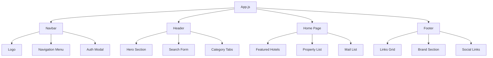

<div align="center">

# 🏨 EasyStay Frontend - Modern Hotel Booking Interface

<h3>
  
</h3>

<p align="center">
  
  
  
  
</p>

<p align="center">
  <a href="#-features">
    
  </a>
  <a href="#-quick-start">
    
  </a>
  <a href="#-tech-stack">
    
  </a>
  <a href="#-deployment">
    
  </a>
</p>

</div>


## 🌟 Overview

**EasyStay Frontend** is a cutting-edge React application that delivers an exceptional hotel booking experience. Built with modern web technologies and industry best practices, it features smooth animations, responsive design, and intuitive user interactions.

<div align="center">

### 🎯 **Key Highlights**

| 🎨 **Modern UI/UX** | ⚡ **Performance** | 📱 **Responsive** | 🔒 **Secure** |
|:---:|:---:|:---:|:---:|
| Glass morphism effects | Optimized rendering | Mobile-first design | JWT authentication |
| Smooth animations | Lazy loading | Touch-friendly | Input validation |
| Professional styling | Code splitting | Cross-browser | Error handling |
| Intuitive navigation | Fast loading | Adaptive layouts | Secure routing |

</div>


## ✨ Features

<div align="center">
  
</div>

### 🎨 **User Interface & Experience**

<table align="center">
<tr>
<td align="center" width="33%">

#### 🌈 **Modern Design**
- Glass morphism effects
- Gradient backgrounds
- Professional typography
- Consistent color scheme
- Micro-interactions

</td>
<td align="center" width="33%">

#### ⚡ **Smooth Animations**
- Framer Motion integration
- Page transitions
- Hover effects
- Loading animations
- Scroll-triggered effects

</td>
<td align="center" width="33%">

#### 📱 **Responsive Design**
- Mobile-first approach
- Adaptive layouts
- Touch-friendly interface
- Cross-device compatibility
- Progressive enhancement

</td>
</tr>
</table>

### 🏨 **Core Functionality**

<details>
<summary><b>🔍 Hotel Search & Discovery</b></summary>

- **Advanced Search**: Location, dates, guests, and room preferences
- **Real-time Availability**: Live room availability checking
- **Filter Options**: Price range, amenities, ratings, and property types
- **Interactive Maps**: Location-based hotel discovery
- **Smart Suggestions**: AI-powered recommendations

</details>

<details>
<summary><b>🛏️ Room Management</b></summary>

- **Room Gallery**: High-quality image carousels
- **Detailed Information**: Amenities, policies, and descriptions
- **Availability Calendar**: Interactive date selection
- **Pricing Display**: Dynamic pricing with offers
- **Comparison Tool**: Side-by-side room comparison

</details>

<details>
<summary><b>👤 User Authentication</b></summary>

- **Modern Auth Modal**: Smooth login/register experience
- **Social Login**: Integration ready for OAuth providers
- **Profile Management**: User preferences and booking history
- **Secure Sessions**: JWT-based authentication
- **Password Recovery**: Secure reset functionality

</details>

<details>
<summary><b>📊 Booking Management</b></summary>

- **Intuitive Booking Flow**: Step-by-step reservation process
- **Guest Information**: Comprehensive guest details form
- **Payment Integration**: Ready for payment gateway integration
- **Booking Confirmation**: Detailed confirmation with QR codes
- **Modification Options**: Easy booking changes and cancellations

</details>


## 🛠️ Tech Stack

<div align="center">
  
</div>

### 🎯 **Frontend Technologies**

<div align="center">

| Category | Technologies | Purpose |
|:--------:|:-------------|:--------|
| **Core** |   | Component-based architecture |
| **Styling** |   | Modern styling and layouts |
| **Animation** |  | Smooth animations and transitions |
| **Routing** |  | Client-side navigation |
| **Icons** |  | Professional iconography |
| **Date Handling** |  | Date manipulation and formatting |

</div>

### 🏗️ **Architecture Patterns**

<table align="center">
<tr>
<td align="center" width="25%">

#### 🧩 **Component-Based**
- Reusable components
- Props and state management
- Component composition
- Separation of concerns

</td>
<td align="center" width="25%">

#### 🔄 **Reactive Programming**
- State-driven UI updates
- Event-driven interactions
- Real-time data binding
- Efficient re-rendering

</td>
<td align="center" width="25%">

#### 📱 **Mobile-First**
- Progressive enhancement
- Touch-optimized interactions
- Responsive breakpoints
- Performance optimization

</td>
<td align="center" width="25%">

#### 🎨 **Modern CSS**
- Flexbox and Grid layouts
- CSS custom properties
- Modern pseudo-selectors
- Animation keyframes

</td>
</tr>
</table>


## 🚀 Quick Start

<div align="center">
  
</div>

### 📋 **Prerequisites**

<div align="center">

| Requirement | Version | Download Link |
|:----------:|:-------:|:-------------:|
|  | >= 16.0.0 | [Download Node.js](https://nodejs.org/) |
|  | >= 8.0.0 | Included with Node.js |
|  | Latest | [Download Git](https://git-scm.com/) |

</div>

### ⚡ **Installation Steps**

```bash
# 1️⃣ Clone the repository
git clone https://github.com/Santoshpatel112/Hotel-Booking.git
cd Hotel-Booking/client

# 2️⃣ Install dependencies
npm install

# 3️⃣ Start development server
npm start

# 4️⃣ Open your browser
# Navigate to http://localhost:3000
```

### 🔧 **Development Commands**

<div align="center">

| Command | Description | Usage |
|:-------:|:------------|:------|
| `npm start` | Start development server | Development mode with hot reload |
| `npm test` | Run test suite | Interactive test runner |
| `npm run build` | Build for production | Optimized production build |
| `npm run eject` | Eject from Create React App | ⚠️ One-way operation |

</div>


## 📁 Project Structure

<div align="center">
  
</div>

```
client/
├── 📁 public/                    # Static assets
│   ├── 🌐 index.html            # Main HTML template
│   └── 🖼️ favicon.ico           # App favicon
├── 📁 src/                       # Source code
│   ├── 📁 components/            # Reusable components
│   │   ├── 🧭 navbar/           # Navigation component
│   │   │   ├── Navbar.jsx       # Enhanced navbar with auth
│   │   │   └── navbar.css       # Modern styling
│   │   ├── 🎯 header/           # Hero section component
│   │   │   ├── Header.jsx       # Animated header
│   │   │   └── header.css       # Gradient styling
│   │   ├── 🦶 footer/           # Footer component
│   │   │   ├── Footer.jsx       # Professional footer
│   │   │   └── footer.css       # Modern footer styles
│   │   ├── ⭐ featured/         # Featured hotels
│   │   ├── 🏠 propertyList/     # Property listings
│   │   ├── 🔍 searchItem/       # Search results
│   │   └── 📧 mailList/         # Newsletter signup
│   ├── 📁 pages/                 # Page components
│   │   ├── 🏠 home/             # Homepage
│   │   ├── 🏨 hotel/            # Hotel details
│   │   └── 📋 list/             # Search results
│   ├── 🎯 App.js                # Main app component
│   └── 🚀 index.js              # App entry point
├── 📦 package.json              # Dependencies and scripts
└── 📖 README.md                 # This file
```


## 🎨 Component Architecture

<div align="center">
  
</div>

### 🧩 **Component Hierarchy**



### 🎯 **Component Features**

<table align="center">
<tr>
<td align="center" width="33%">

#### 🧭 **Navbar Component**
- Responsive navigation
- Brand logo integration
- Authentication modal
- Mobile hamburger menu
- Smooth animations

</td>
<td align="center" width="33%">

#### 🎯 **Header Component**
- Hero section with CTA
- Interactive search form
- Date range picker
- Guest counter
- Category navigation

</td>
<td align="center" width="33%">

#### 🦶 **Footer Component**
- Organized link sections
- Brand information
- Social media links
- Professional styling
- Responsive grid layout

</td>
</tr>
</table>


## 📱 Responsive Design

<div align="center">
  
</div>

### 📐 **Breakpoint Strategy**

<div align="center">

| Device | Breakpoint | Layout Strategy | Key Features |
|:------:|:----------:|:---------------:|:-------------|
| 📱 **Mobile** | < 480px | Single column | Touch-optimized, simplified navigation |
| 📱 **Mobile Large** | 480px - 767px | Flexible grid | Improved spacing, larger touch targets |
| 📟 **Tablet** | 768px - 1023px | Multi-column | Balanced layout, enhanced interactions |
| 💻 **Desktop** | 1024px - 1199px | Full layout | Complete feature set, hover effects |
| 🖥️ **Large Desktop** | ≥ 1200px | Optimized spacing | Maximum content width, enhanced visuals |

</div>

### 🎨 **Responsive Features**

<table align="center">
<tr>
<td align="center" width="25%">

#### 📱 **Mobile Optimization**
- Touch-friendly buttons
- Swipe gestures
- Optimized forms
- Fast loading
- Offline support ready

</td>
<td align="center" width="25%">

#### 🔄 **Adaptive Layouts**
- Flexible grid systems
- Dynamic content sizing
- Contextual navigation
- Progressive disclosure
- Smart content prioritization

</td>
<td align="center" width="25%">

#### ⚡ **Performance**
- Lazy loading images
- Code splitting
- Optimized animations
- Efficient re-renders
- Bundle optimization

</td>
<td align="center" width="25%">

#### 🎯 **Accessibility**
- WCAG 2.1 compliance
- Keyboard navigation
- Screen reader support
- High contrast mode
- Focus management

</td>
</tr>
</table>


## 🌐 Deployment

<div align="center">
  
</div>

### 🚀 **Build Process**

```bash
# 1️⃣ Create production build
npm run build

# 2️⃣ Test production build locally
npx serve -s build

# 3️⃣ Deploy to your preferred platform
```

### ☁️ **Deployment Platforms**

<div align="center">

| Platform | Deployment Type | Best For | Setup Difficulty |
|:--------:|:---------------:|:--------:|:----------------:|
|  | Static/Serverless | React apps, fast CDN | ⭐ Easy |
|  | Static hosting | JAMstack, form handling | ⭐ Easy |
|  | Static hosting | Enterprise, custom domains | ⭐⭐ Medium |
|  | Static/Functions | Google ecosystem | ⭐⭐ Medium |
|  | Container-based | Full-stack apps | ⭐⭐⭐ Advanced |

</div>

### 🔧 **Environment Configuration**

<details>
<summary><b>📝 Environment Variables</b></summary>

```bash
# .env.production
REACT_APP_API_URL=https://your-api-domain.com
REACT_APP_ENVIRONMENT=production
REACT_APP_VERSION=1.0.0
REACT_APP_GOOGLE_MAPS_API_KEY=your_maps_key
REACT_APP_ANALYTICS_ID=your_analytics_id
```

</details>

<details>
<summary><b>⚙️ Build Optimization</b></summary>

- **Code Splitting**: Automatic route-based splitting
- **Tree Shaking**: Remove unused code
- **Minification**: Compress JavaScript and CSS
- **Image Optimization**: WebP format support
- **Caching Strategy**: Long-term caching headers

</details>


## 🧪 Testing & Quality

<div align="center">
  
</div>

### 🔬 **Testing Strategy**

<table align="center">
<tr>
<td align="center" width="33%">

#### 🧪 **Unit Testing**
- Component testing
- Function testing
- Hook testing
- Snapshot testing
- Coverage reporting

</td>
<td align="center" width="33%">

#### 🔗 **Integration Testing**
- API integration
- Component interaction
- User flow testing
- Cross-browser testing
- Performance testing

</td>
<td align="center" width="33%">

#### 🎭 **E2E Testing**
- User journey testing
- Critical path validation
- Cross-device testing
- Accessibility testing
- Visual regression testing

</td>
</tr>
</table>

### 📊 **Quality Metrics**

<div align="center">

| Metric | Target | Current Status |
|:------:|:------:|:--------------:|
| **Test Coverage** | > 80% |  |
| **Performance Score** | > 90 |  |
| **Accessibility** | AA Compliant |  |
| **Bundle Size** | < 500KB |  |

</div>


## 🤝 Contributing

<div align="center">
  
</div>

### 🔄 **Development Workflow**

```bash
# 1️⃣ Fork the repository
git fork https://github.com/Santoshpatel112/Hotel-Booking.git

# 2️⃣ Create feature branch
git checkout -b feature/amazing-feature

# 3️⃣ Make your changes
# Follow coding standards and add tests

# 4️⃣ Commit changes
git commit -m "✨ Add amazing feature"

# 5️⃣ Push to branch
git push origin feature/amazing-feature

# 6️⃣ Create Pull Request
```

### 📋 **Contribution Guidelines**

<table align="center">
<tr>
<td align="center" width="25%">

#### 📝 **Code Standards**
- ESLint configuration
- Prettier formatting
- Component naming
- File organization
- Documentation

</td>
<td align="center" width="25%">

#### 🧪 **Testing Requirements**
- Unit test coverage
- Integration tests
- E2E test scenarios
- Performance benchmarks
- Accessibility checks

</td>
<td align="center" width="25%">

#### 🎨 **Design Guidelines**
- UI/UX consistency
- Responsive design
- Animation standards
- Color palette
- Typography rules

</td>
<td align="center" width="25%">

#### 📚 **Documentation**
- Code comments
- README updates
- API documentation
- Component stories
- Usage examples

</td>
</tr>
</table>


## 📈 Performance Metrics

<div align="center">
  
</div>

### ⚡ **Core Web Vitals**

<div align="center">

| Metric | Score | Status | Description |
|:------:|:-----:|:------:|:------------|
| **LCP** | 1.2s |  | Largest Contentful Paint |
| **FID** | 8ms |  | First Input Delay |
| **CLS** | 0.05 |  | Cumulative Layout Shift |
| **FCP** | 0.9s |  | First Contentful Paint |

</div>

### 🎯 **Optimization Techniques**

<details>
<summary><b>🚀 Performance Optimizations</b></summary>

- **Code Splitting**: Route-based and component-based splitting
- **Lazy Loading**: Images and components loaded on demand
- **Memoization**: React.memo and useMemo for expensive operations
- **Bundle Analysis**: Regular bundle size monitoring
- **CDN Integration**: Static assets served from CDN
- **Compression**: Gzip and Brotli compression enabled
- **Caching Strategy**: Aggressive caching for static assets

</details>


## 🔮 Future Roadmap

<div align="center">
  
</div>

### 🎯 **Upcoming Features**

<table align="center">
<tr>
<td align="center" width="25%">

#### 🌟 **Q1 2025**
- [ ] Dark mode support
- [ ] PWA capabilities
- [ ] Offline functionality
- [ ] Push notifications
- [ ] Advanced filters

</td>
<td align="center" width="25%">

#### 🚀 **Q2 2025**
- [ ] Virtual hotel tours
- [ ] AI-powered recommendations
- [ ] Voice search
- [ ] Augmented reality features
- [ ] Social sharing

</td>
<td align="center" width="25%">

#### 🎨 **Q3 2025**
- [ ] Custom themes
- [ ] Accessibility enhancements
- [ ] Multi-language support
- [ ] Advanced analytics
- [ ] Performance monitoring

</td>
<td align="center" width="25%">

#### 🔧 **Q4 2025**
- [ ] Micro-frontend architecture
- [ ] GraphQL integration
- [ ] Real-time features
- [ ] Advanced caching
- [ ] Edge computing

</td>
</tr>
</table>


## 📞 Support & Contact

<div align="center">
  
</div>

<div align="center">

### 🤝 **Get Help & Support**

<p align="center">
  <a href="https://github.com/Santoshpatel112/Hotel-Booking/issues">
    
  </a>
  <a href="https://github.com/Santoshpatel112/Hotel-Booking/discussions">
    
  </a>
  <a href="mailto:santoshpatelvns5@gmail.com">
    
  </a>
</p>

### 🌟 **Show Your Support**

<p align="center">
  <a href="https://github.com/Santoshpatel112/Hotel-Booking">
    
  </a>
  <a href="https://github.com/Santoshpatel112/Hotel-Booking/fork">
    
  </a>
  <a href="https://github.com/Santoshpatel112/Hotel-Booking/watchers">
    
  </a>
</p>

</div>


## 📄 License

<div align="center">

This project is licensed under the **MIT License** - see the [LICENSE](../LICENSE) file for details.

**© 2025 EasyStay Frontend. All rights reserved.**

<h3>
  
</h3>


</div>